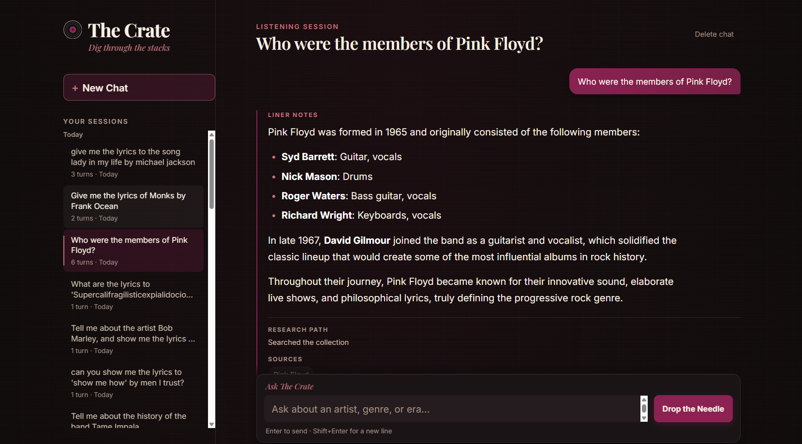
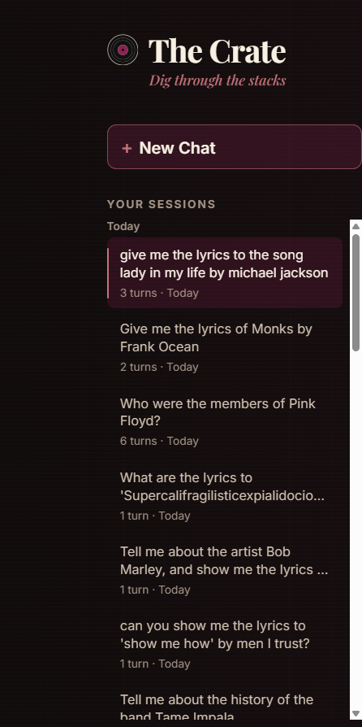
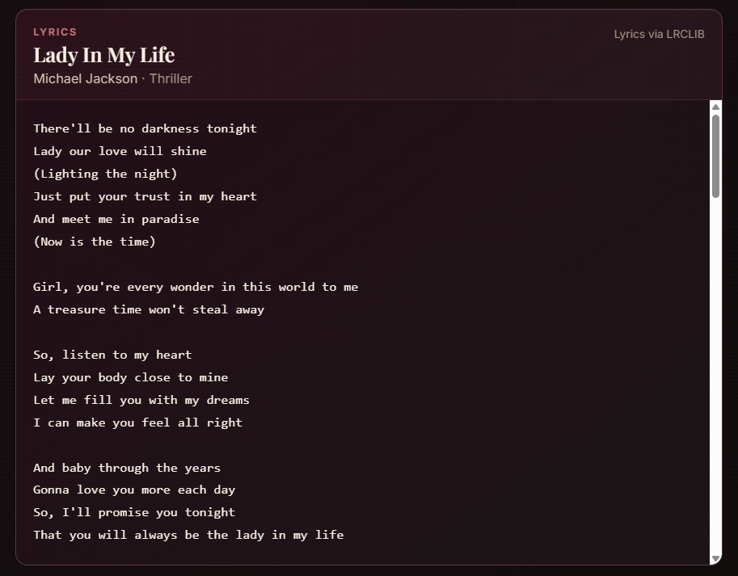
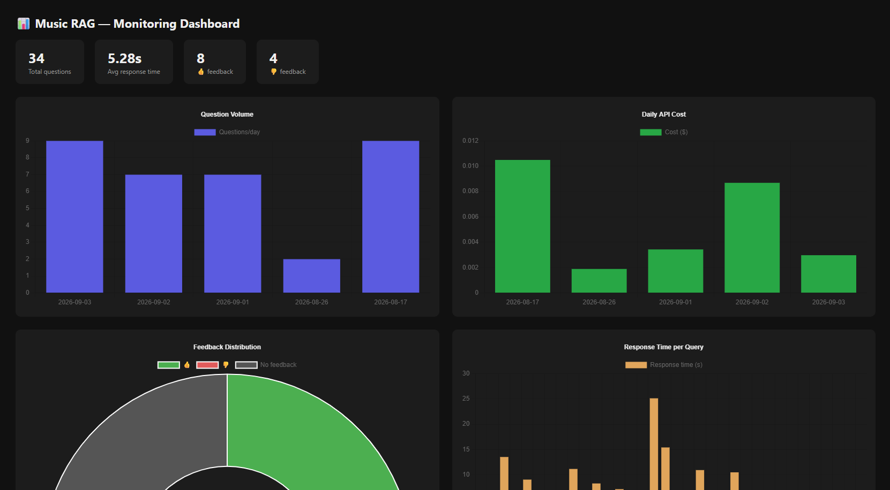
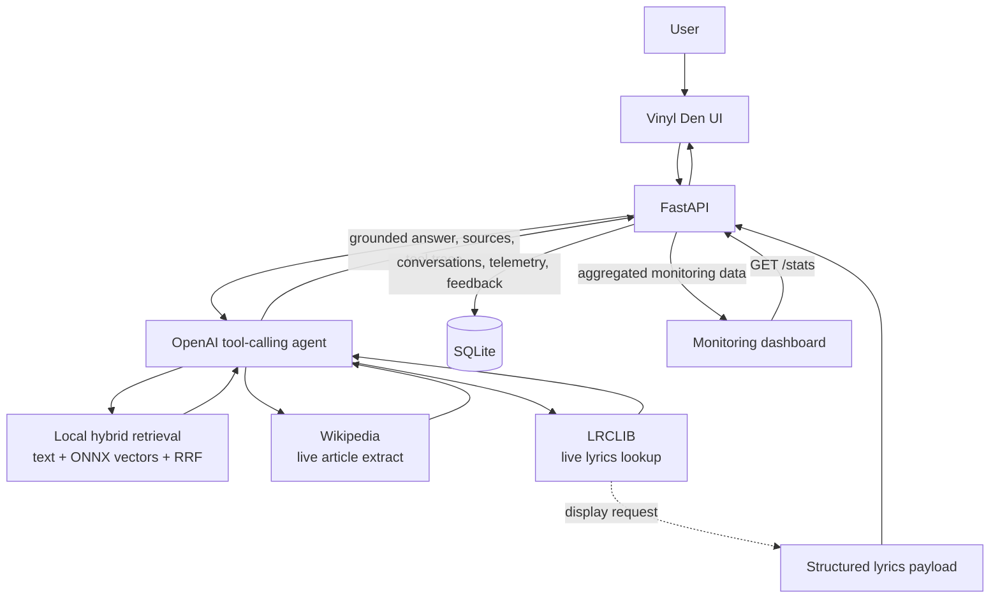

# The Crate

The Crate is a music research companion with the feel of a late-night record shop. Ask about artists, genres, albums, or songs and it combines local retrieval with live Wikipedia and LRCLIB lookups. Persistent conversations, telemetry, and a monitoring dashboard make the experience easy to revisit and inspect.

**Built with:** FastAPI, OpenAI tool calling, local ONNX embeddings, SQLite, vanilla JavaScript, Wikipedia, LRCLIB, and Docker.

<a href="https://drive.google.com/file/d/1-5I93lhEX9--NmXxnsCXB5pKohaNZWsY/view?usp=sharing" title="Watch the 36-second demo">
  
</a>

**[▶ Watch demo — 36 seconds](https://drive.google.com/file/d/1-5I93lhEX9--NmXxnsCXB5pKohaNZWsY/view?usp=sharing)**

## Highlights

- **OpenAI tool-calling agent** selects and sequences local search, Wikipedia, and lyrics tools.
- **Local hybrid retrieval** combines lexical and semantic search with Reciprocal Rank Fusion.
- **Live Wikipedia** expands research beyond the committed local collection.
- **Structured LRCLIB lyrics display** keeps provider lyrics separate from model-generated prose.
- **Persistent SQLite conversations** can be created, reopened, and deleted.
- **Bounded context** sends only a limited, conversation-scoped window of prior turns to the model.
- **Telemetry and feedback** capture response time, tokens, estimated cost, tools, sources, and answer ratings.
- **Monitoring dashboard** visualizes usage, latency, cost, feedback, and agent tool usage.
- **Sanitized frontend rendering** cleans model Markdown before it reaches the DOM.
- **Evaluated retrieval** compares text, vector, and hybrid retrieval with hit rate and MRR.

## Demo

| Chat experience | Persistent history |
| --- | --- |
|  |  |
| **Structured lyrics** | **Monitoring dashboard** |
|  |  |

## How It Works



The agent is instructed to ground factual answers in tool results. For direct lyrics-display requests, verified LRCLIB data can travel to the UI as a structured payload; the application does not ask the model to reproduce the complete lyric body.

## Key Features

| Area | What it does |
| --- | --- |
| Research path | The UI shows tools used and returned source labels alongside responses. |
| Local knowledge | A committed corpus and matching precomputed embeddings provide a reproducible local retrieval path. |
| Live sources | Wikipedia supplies article extracts when the local collection is insufficient; LRCLIB serves track-specific lyrics data. |
| Conversations | Chats receive stable IDs, automatic first-question titles, reopenable history, and scoped deletion. |
| Feedback loop | Each answer can receive a positive or negative rating tied to its conversation and interaction. |
| Vinyl Den UX | Loading, cancellation, retry, responsive layout, and user-facing error states are built into the interface. |

## Engineering Decisions

| Decision | Rationale |
| --- | --- |
| SQLite for application state | Conversations and telemetry are modest, relational, and accessed through short-lived connections. SQLite keeps the app portable, inspectable, and simple to run locally or in Docker. |
| ONNX embeddings run locally | The embedding model runs without a hosted vector service, keeping retrieval self-contained once the pinned model is downloaded. |
| Precomputed embeddings | `data/embeddings.npy` is committed alongside the corpus, so normal startup loads vectors rather than rebuilding them. |
| Bounded conversation context | Recent history is limited to four turns and 8,000 characters, preserving follow-ups while bounding request size and preventing cross-conversation leakage. |
| Lyrics separate from prose | Full lyrics come from validated LRCLIB data and are displayed structurally. Lyric bodies are not stored in conversation logs. |
| Sanitized Markdown | Model answers are converted from Markdown and sanitized with DOMPurify. User input, lyrics, sources, and tool labels are inserted with DOM text APIs. |

## Evaluation

The local retrieval evaluation compares top-five results from text, vector, and hybrid search against generated question-to-document pairs.

| Method | Hit rate | MRR |
| --- | ---: | ---: |
| Text | 0.649 | 0.547 |
| Vector | 0.905 | 0.785 |
| Hybrid | 0.910 | 0.711 |

Hybrid retrieval has the highest hit rate, while vector search has the strongest MRR. Adding text retrieval slightly improves whether a relevant chunk appears in the top five, but it lowers the average rank of the first relevant result. The application currently uses hybrid retrieval for its local-search tool.

These results describe retrieval only; they are not an end-to-end evaluation of the final tool-calling application.

## Monitoring

The dashboard reads `/stats` and visualizes the interaction log:

- question volume over time;
- estimated API cost by day;
- positive, negative, and absent feedback;
- response time per query; and
- recorded agent tool usage.

SQLite records timing, token counts, estimated cost, tools used, sources, and feedback. The dashboard endpoint does not expose question or answer text.

## Tech Stack

| Layer | Technology |
| --- | --- |
| API and agent loop | Python, FastAPI, OpenAI `gpt-4o-mini` function calling |
| Retrieval | `minsearch`, NumPy, Reciprocal Rank Fusion |
| Embeddings | `bge-small-en-v1.5` via ONNX Runtime and `tokenizers` |
| Live sources | Wikipedia MediaWiki API, LRCLIB API |
| Persistence and monitoring | SQLite, Chart.js |
| Frontend | Vanilla HTML, CSS, JavaScript, Marked, DOMPurify |
| Tooling | `uv`, pytest, Docker Compose |

## Project Structure

```text
app/
  main.py                 FastAPI routes, agent loop, SQLite logging
src/
  tools.py                Local, Wikipedia, and LRCLIB tools
  search.py               Text, vector, and hybrid retrieval
  embedder.py             Local ONNX embedding implementation
  ingest.py               Curated Wikipedia corpus refresh
  build_embeddings.py     Precompute local vectors
  evaluate.py             Retrieval evaluation
static/
  index.html              Vinyl Den chat interface
  dashboard.html          Monitoring dashboard
data/
  docs.json               Committed local corpus
  embeddings.npy          Matching precomputed embeddings
tests/                     API, persistence, tools, and retrieval tests
```

## Run Locally

Prerequisites: Python 3.11+, [uv](https://docs.astral.sh/uv/), an OpenAI API key, and internet access for the one-time model download and live-source requests.

```bash
git clone https://github.com/eyademamm/Music-Encyclopedia-RAG.git music-rag
cd music-rag
cp .env.example .env
# Set OPENAI_API_KEY in .env

uv sync --frozen
uv run python src/download_model.py
uv run uvicorn app.main:app --host 0.0.0.0 --port 8000 --reload
```

Open [http://localhost:8000](http://localhost:8000) for The Crate and [http://localhost:8000/static/dashboard.html](http://localhost:8000/static/dashboard.html) for monitoring.

The repository already includes the local corpus and matching precomputed embeddings. Rebuild them only when intentionally refreshing the retrieval snapshot:

```bash
uv run python src/ingest.py
uv run python src/build_embeddings.py
uv run python src/evaluate.py
```

Generating the question set or running the separate LLM-judge script also requires `OPENAI_API_KEY`:

```bash
uv run python src/generate_ground_truth.py
uv run python src/evaluate_llm.py
```

## Docker

Create `.env` as above, set `OPENAI_API_KEY`, then build and start the application:

```bash
docker compose up --build
```

The image downloads the repository's pinned embedding model during the build and includes the committed corpus and embeddings. Docker Compose stores SQLite runtime data in the `app_runtime` named volume at `/code/runtime/logs.db`, so conversation history and telemetry survive container replacement.

## Tests

Run the suite with:

```bash
uv run pytest
```

Tests cover request validation, conversation persistence and isolation, SQLite migration behavior, bounded context, telemetry, structured lyrics handling, tool-provider failures, agent-loop limits, hybrid-ranking behavior, and corpus/embedding alignment. They use mocks for external services and do not require network-dependent ingestion or evaluation.

## What I Learned

Building The Crate sharpened the practical boundaries around a small retrieval application: model tool calls need deterministic server-side validation, retrieval assets must be versioned as a matched pair, and conversational context needs explicit limits rather than unbounded replay. Separating provider-owned data such as lyrics from generated text also made the UI safer and the persistence model clearer.

## Possible Next Steps

- Version retrieval evaluation artifacts alongside the corpus snapshot.
- Add curated end-to-end evaluation cases for tool selection and source grounding.
- Add richer source links and retrieval-result inspection to the UI.
